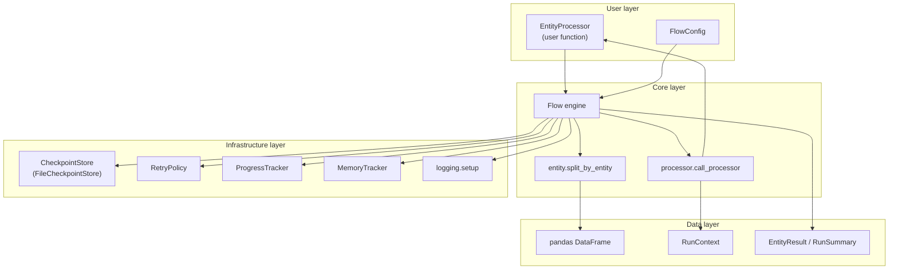

# Architecture

## Overview

TimeSeriesFlow follows a layered architecture: user code sits at the top; the `Flow` engine orchestrates cross-cutting concerns through pluggable components.

## Package architecture diagram

## Module responsibilities

| Module | Role |
|--------|------|
| `core.engine` | Main orchestration loop |
| `core.entity` | Entity discovery and dataframe splitting |
| `core.processor` | Processor protocol and invocation |
| `config` | `FlowConfig` dataclass |
| `checkpoint` | Resume support via abstract store + file backend |
| `retry` | Exponential backoff retry policy |
| `progress` | Rich progress bar and run summary |
| `memory` | Peak RSS tracking via psutil |
| `logging` | Console logging setup |
| `cli` | Typer CLI entry points |
| `types` | Shared dataclasses and type aliases |
| `exceptions` | Error hierarchy |

## Execution flow

1. `Flow.run(df)` lists unique entities from `entity_column`.
2. If resume is enabled, completed entities are loaded from checkpoint store.
3. For each pending entity:
   - Split entity dataframe
   - Invoke processor with retries
   - Track memory and duration
   - Save checkpoint record
   - Update progress display
4. Concatenate successful outputs and return `(combined_df, RunSummary)`.

## Design principles

- **Single responsibility**: user code handles domain logic only
- **Explicit configuration**: no hidden global state
- **Extensibility**: abstract `CheckpointStore` for future backends (S3, Redis, DB)
- **Type safety**: Protocol-based processor contract, mypy strict
- **Minimal dependencies**: pandas ecosystem plus psutil, rich, typer

## Future extensions (not in v0.1)

- Parallel entity execution (ProcessPool / ThreadPool)
- Pluggable result sinks (Parquet, Delta, database)
- Distributed checkpoint backends
- Metrics export (Prometheus, OpenTelemetry)
